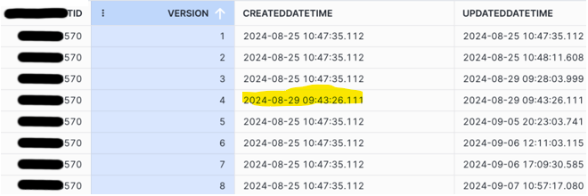

# 2024-09-18

This is a true story. At the request of the models involved in this event, the names have been changed.

## Problem

A `Widget` transitioning from `Off` to `On` caused a new creation timestamp to be generated, and applied only to a single `WidgetVersion` record. This had apparently been happening for many years, causing consternation within the reporting team.



The cause puzzled many engineers, because all other `Widget` updates carry the timestamp forward correctly via this code:

```C#
public sealed partial class Widget
{
	public WidgetVersion AddWidgetVersion()
	{
		var firstWidget = WidgetVersions.FirstOrDefault(x => x.Version == 1);
		var widgetVersion = new WidgetVersion
		{
			Version = (WidgetVersions.FirstOrDefault(x => x.IsLatest == true)?.Version ?? 0) + 1,
			CreatedDateTime = firstWidget?.CreatedDateTime ?? SystemClock.UtcNow
		}
	}
}
```

## Solution

When querying for an existing `WidgetVersion` with a given `DongleId`, only a single `WidgetVersion` was being loaded by EF. I simply had to ensure all earlier versions were also being loaded:

```diff
internal IQueryable<WidgetVersion> BuildQuery(IQueryable<WidgetVersion> efq, long dongleId)
{
	return efq.Where(x => x.DongleId == dongleId && x.IsLatest == true)
		.Include(x => x.Widget)
+		.Include(x => x.Widget.WidgetVersions);
}
```

By loading all existing `WidgetVersion` records for a given `DongleId`, we can be sure that the `Version 1` record exists in the `Widget.WidgetVersions` collection and can be located via `FirstOrDefault(x => x.Version == 1)`. This code now works as expected:

```C#
var previousWidgetVersion = BuildQuery(_dbContext.Set<WidgetVersion>()).FirstOrDefault();
var saveWidget = previousWidgetVersion.Widget;
saveWidget.AddWidgetVersion();
_dbContext.Update(saveWidget);
_dbContext.SaveChanges()
```
