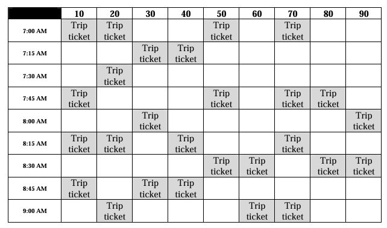

# Dispatching Made Easy (2006)

Developing DME was my first professional software engagement. I had no idea what I was doing, but I was confident I'd figure it out!

It was a Windows GUI application written in C# (my first time using that language), backed by a Microsoft Access database. It used a home-grown encryption algorithm (the details of which I no longer recall) so that customer data was not stored in clear text.

The software mostly consisted of a day planner view, where the user could match vehicles with customers and specific pickup/dropoff times, and mark the status of the trip (en-route to customer, picked up, etc). There were also some basic CRUD screens for inputting vehicle/driver/customer information.

_Vehicle IDs on the top row._

The first draft of the UI was composed of distinct text boxes for each time slot. I had to hook into various control events to allow clicking and dragging of data in/out of the boxes. This approach worked but was quite inefficient, and there was a noticeable amount of lag, due to the large amount of controls being rendered on the screen at one time.

A demo day with the client was fast approaching, and I was not happy at all with the performance, so I looked for alternatives. Eventually I discovered the `DataGrid` control, which was exactly what I wanted -- it was a single object that was already broken out into a grid, and I could hook into mouse events when moving between cells in order to allow drag/drop of tickets.

The project took about 3 months, and was eventually released on CD.
